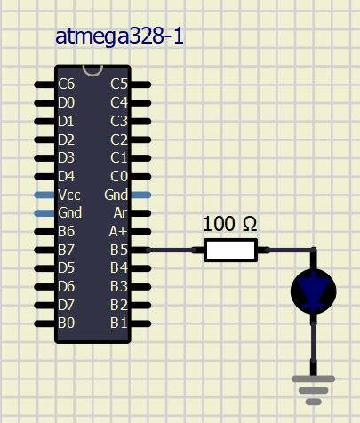

# Lab 1: Vojtěch Hroch

### Blink example

1. What is the meaning of the following binary operators in C?
   * `|`  OR
   * `&`  AND
   * `^`  XOR
   * `~`  NOT
   * `<<` Bitový posun vlevo
   * `>>` Bitový posun vpravo

2. Complete truth table with operators: `|`, `&`, `^`, `~`

| **b** | **a** |**b or a** | **b and a** | **b xor a** | **not b** |
| :-:   | :-:   | :-:       | :-:         | :-:         | :-:       |
| 0     | 0     |0          |0            |0            |1          |
| 0     | 1     |1          |0            |1            |1          |
| 1     | 0     |1          |0            |1            |0          |
| 1     | 1     |1          |1            |0            |0          |


### Morse code

1. Listing of C code with syntax highlighting which repeats one "dot" and one "comma" on a LED:

```c
#ifndef F_CPU           // Preprocessor directive allows for conditional
// compilation. The #ifndef means "if not defined".
# define F_CPU 16000000 // CPU frequency in Hz required for delay
#endif                  // The #ifndef directive must be closed by #endif

#define LED_GREEN PB5
#define SHORT_DELAY 200
#define LONG_DELAY 600
#define SPACE_DELAY 1000

#include <avr/io.h>
#include <util/delay.h>

void carka();
void tecka();
void mezera();

int main(void)
{
	// Set pin as output in Data Direction Register
	// DDRB = DDRB or 0010 0000
	DDRB = DDRB | (1<<LED_GREEN);

	// Set pin LOW in Data Register (LED off)
	// PORTB = PORTB and 1101 1111
	PORTB = PORTB & ~(1<<LED_GREEN);

	// Infinite loop
	while (1)
	{
		// Pause several milliseconds
		_delay_ms(SHORT_DELAY);
		//BRNO

		carka();
		tecka();
		tecka();
		tecka();
		
		mezera();
		
		tecka();
		carka();
		tecka();
		
		mezera();
		
		carka();
		tecka();
		
		mezera();
		
		carka();
		carka();
		carka();
	}

	// Will never reach this
	return 0;
}
void carka()
{
	PORTB = PORTB ^ (1<<LED_GREEN);
	_delay_ms(LONG_DELAY);
	PORTB = PORTB & ~(1<<LED_GREEN);
	_delay_ms(LONG_DELAY);
}
void tecka()
{
	PORTB = PORTB ^ (1<<LED_GREEN);
	_delay_ms(SHORT_DELAY);
	PORTB = PORTB & ~(1<<LED_GREEN);
	_delay_ms(LONG_DELAY);
}
void mezera()
{
	_delay_ms(SPACE_DELAY);
}
```


2. Scheme of Morse code application, i.e. connection of AVR device, LED, resistor, and supply voltage. The image can be drawn on a computer or by hand. Always name all components and their values!


