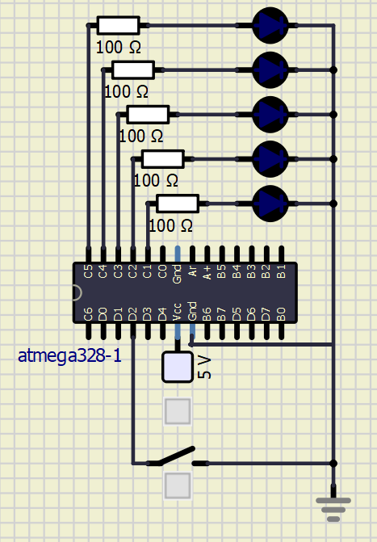

[Calculate LED resistor value](https://electronicsclub.info/leds.htm) for typical red and blue LEDs.

&nbsp;

&nbsp;

| **LED color** | **Supply voltage** | **LED current** | **LED voltage** | **Resistor value** |
| :-: | :-: | :-: | :-: | :-: |
| red | 5&nbsp;V | 20&nbsp;mA |2 V | 150 Ohm |
| blue | 5&nbsp;V | 20&nbsp;mA |3 V |100 Ohm |

> Note that, equation was generated by [Online LaTeX Equation Editor](https://www.codecogs.com/latex/eqneditor.php) using the following code.
```LaTeX
R = \frac{V_{SUPPLY}-V_{LED}}{I} =
```
>

3. Draw the basic ways to connect a push button to the microcontroller input pin: button active-low, button active-high.

| **DDRB** | **Description** |
| :-: | :-- |
| 0 | Input pin |
| 1 | Output pin|

| **PORTB** | **Description** |
| :-: | :-- |
| 0 | Output low value |
| 1 | Output high value|

| **DDRB** | **PORTB** | **Direction** | **Internal pull-up resistor** | **Description** |
| :-: | :-: | :-: | :-: | :-- |
| 0 | 0 | input | no | Tri-state, high-impedance |
| 0 | 1 | input | yes | pxn will source current if ext pulled low|
| 1 | 0 | output | no | low out |
| 1 | 1 | output | no | high out|

| **Port** | **Pin** | **Input/output usage?** |
| :-: | :-: | :-- |
| A | x | Microcontroller ATmega328P does not contain port A |
| B | 0 | Yes (Arduino pin 8) |
|   | 1 | yes arduino pin -9 |
|   | 2 | pin -10 |
|   | 3 | pin -11 |
|   | 4 | pin 12 |
|   | 5 | pin 13 |
|   | 6 | -- |
|   | 7 | -- |
| C | 0 | Yes (Arduino pin A0) |
|   | 1 | pin A1 |
|   | 2 | pin A2 |
|   | 3 | pin A3 |
|   | 4 | pin A4 |
|   | 5 | pin A5 |
|   | 6 | -- |
|   | 7 | -- |
| D | 0 | Yes (Arduino pin RX<-0) |
|   | 1 | pin TX->1 |
|   | 2 | pin 2 |
|   | 3 | pin -3|  
|   | 4 | pin 4 |
|   | 5 | pin -5|
|   | 6 | pin -6|
|   | 7 | pin 7 |


```c
#define LED_GREEN   PB5
#define LED_RED		PC1     // AVR pin where green LED is connected
#define BLINK_DELAY 500
//#define BUTTON
#ifndef F_CPU
# define F_CPU 16000000     // CPU frequency in Hz required for delay
#endif

/* Includes ----------------------------------------------------------*/
#include <util/delay.h>     // Functions for busy-wait delay loops
#include <avr/io.h>         // AVR device-specific IO definitions

/* Functions ---------------------------------------------------------*/
/**********************************************************************
 * Function: Main function where the program execution begins
 * Purpose:  Toggle two LEDs when a push button is pressed.
 * Returns:  none
 **********************************************************************/
int main(void)
{
    // Green LED at port B
    // Set pin as output in Data Direction Register...
    // ...and turn LED off in Data Register
    // Configure the second LED at port C

	DDRB =	DDRB | (1<<LED_GREEN);
	PORTB =	PORTB & ~(1<<LED_GREEN);

    DDRC =	DDRC | (1<<LED_RED);
    PORTC =	PORTC & ~(1<<LED_RED);

    // Infinite loop
    while (1)
    {
        // Pause several milliseconds
       _delay_ms(BLINK_DELAY);
       PORTC = PORTC ^ (1<<LED_RED);
	   _delay_ms(BLINK_DELAY);
	   PORTC =	PORTC & ~(1<<LED_RED);
	
	   _delay_ms(BLINK_DELAY);
       PORTB = PORTB ^ (1<<LED_GREEN);
	   _delay_ms(BLINK_DELAY);
	   PORTB =	PORTB & ~(1<<LED_GREEN);
    
	}

    // Will never reach this
    return 0;
}
```

Button
```c
#define LED_GREEN   PB5
#define LED_RED		PC1     // AVR pin where green LED is connected
#define BLINK_DELAY 500
#define BUTTON		PD2
#ifndef F_CPU
# define F_CPU 16000000     // CPU frequency in Hz required for delay
#endif

/* Includes ----------------------------------------------------------*/
#include <util/delay.h>     // Functions for busy-wait delay loops
#include <avr/io.h>         // AVR device-specific IO definitions

/* Functions ---------------------------------------------------------*/
/**********************************************************************
 * Function: Main function where the program execution begins
 * Purpose:  Toggle two LEDs when a push button is pressed.
 * Returns:  none
 **********************************************************************/
int main(void)
{
    // Green LED at port B
    // Set pin as output in Data Direction Register...
    // ...and turn LED off in Data Register
    // Configure the second LED at port C

	DDRB =	DDRB | (1<<LED_GREEN);
	PORTB =	PORTB & ~(1<<LED_GREEN);

    DDRC =	DDRC | (1<<LED_RED);
    PORTC =	PORTC & ~(1<<LED_RED);

    // Infinite loop
    while (1)
    {
		if(bit_is_clear(PIND, PD2))
	    {
			PORTC = PORTC ^ (1<<LED_RED);
			PORTB = PORTB ^ (1<<LED_GREEN);
	    }
    
	}

    // Will never reach this
    return 0;
}
```
Knight rider

