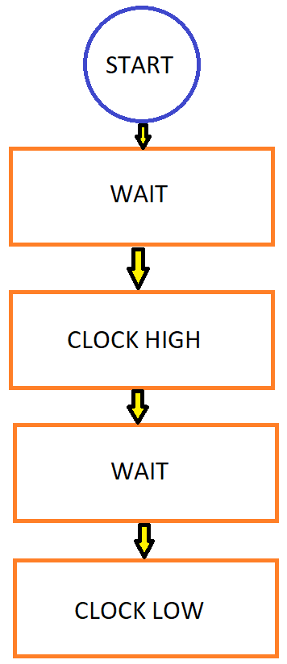

1. Read the [7-segment display tutorial](https://www.electronics-tutorials.ws/blog/7-segment-display-tutorial.html) and find out what is the difference between:
   * Common Cathode 7-segment display (CC SSD)
   * Common Anode 7-segment display (CA SSD)

2. In the following table, write the binary values of the segments for display 0 to 9 on a common anode 7-segment display.

   | **Digit** | **A** | **B** | **C** | **D** | **E** | **F** | **G** | **DP** |
   | :-: | :-: | :-: | :-: | :-: | :-: | :-: | :-: | :-: |
   | 0 | 0 | 0 | 0 | 0 | 0 | 0 | 1 | 1 |
   | 1 | 1 | 0 | 0 | 1 | 1 | 1 | 1 | 1 |
   | 2 | 0 | 0 | 1 | 0 | 0 | 0 | 1 | 1 |
   | 3 | 0 | 0 | 0 | 0 | 1 | 1 | 0 | 1 |
   | 4 | 1 | 0 | 0 | 1 | 1 | 0 | 0 | 1 |
   | 5 | 0 | 1 | 0 | 0 | 1 | 0 | 0 | 1 |
   | 6 | 0 | 1 | 0 | 0 | 0 | 0 | 0 | 0 |
   | 7 | 0 | 0 | 0 | 0 | 0 | 1 | 1 | 1 |
   | 8 | 0 | 0 | 0 | 0 | 0 | 0 | 0 | 1 |
   | 9 | 0 | 0 | 0 | 0 | 1 | 0 | 0 | 0 |
   
   
# Lab 5: Vojtěch Hroch

Link to your `Digital-electronics-2` GitHub repository:

[Link:](https://github.com/xhroch01/Digital-electronics-2)


### 7-segment library

1. In your words, describe the difference between Common Cathode and Common Anode 7-segment display.
   * CC SSD - Jednotlivé segmenty řídíme vysokou úrovní => společná katoda má záporný pin připojen na zem.
   * CA SSD - Jednotlivé segmenty řídíme nízkou úrovní => společná anoda má kladný pin připojen na zem. 

2. Code listing with syntax highlighting of two interrupt service routines (`TIMER1_OVF_vect`, `TIMER0_OVF_vect`) from counter application with at least two digits, ie. values from 00 to 59:

```c
ISR(TIMER1_OVF_vect)
{
    // WRITE YOUR CODE HERE
    cnt0++;
    if (cnt0 > 59)
    {
        cnt0 = 0;
        cnt1++;
        if (cnt1 > 5)
           (cnt1 = 0);
    }    
}

ISR(TIMER0_OVF_vect)
{
		static uint8_t pos = 0;  // This line will only run the first time
        cnt0++;
        if (cnt0 > 9)
        cnt0 = 0;
        
        SEG_update_shift_regs(cnt0, 0);
        SEG_update_shift_regs(cnt1, 0);
}
```

3. Flowchart figure for function `SEG_clk_2us()` which generates one clock period on `SEG_CLK` pin with a duration of 2&nbsp;us. The image can be drawn on a computer or by hand. Use clear descriptions of the individual steps of the algorithms.

   


### Kitchen alarm

Consider a kitchen alarm with a 7-segment display, one LED and three push buttons: start, +1 minute, -1 minute. Use the +1/-1 minute buttons to increment/decrement the timer value. After pressing the Start button, the countdown starts. The countdown value is shown on the display in the form of mm.ss (minutes.seconds). At the end of the countdown, the LED will start blinking.

1. Scheme of kitchen alarm; do not forget the supply voltage. The image can be drawn on a computer or by hand. Always name all components and their values.

   
